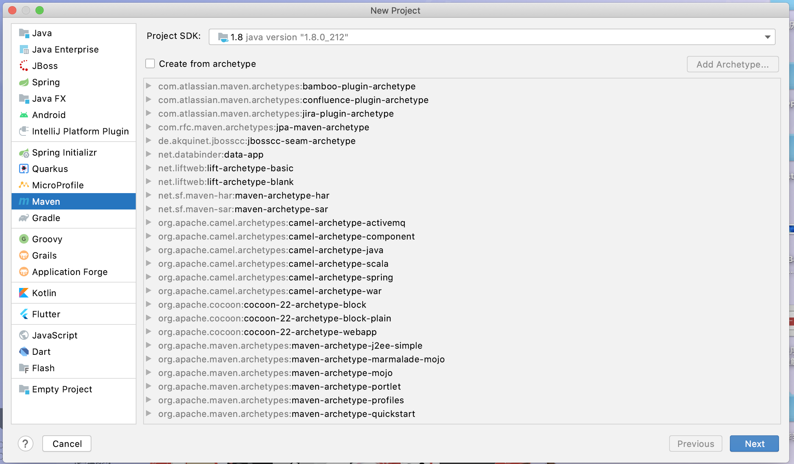
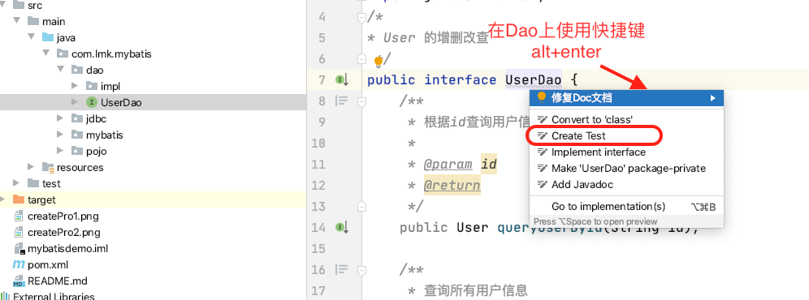

# MyBatis 简单使用

## 一、数据准备

1. 创建`ssmdemo`数据库
2. 创建tb_user表
3. tb_user表添加测试数据

## 二、创建工程

## 三、配置文件

1. 依赖文件中添加mysql、mybatis、junit依赖
2. 创建`mybatis-config.xml`文件，配置相关内容使用JDBC连接数据库
3. 创建mapper相关文件，其中使用sql语句完成操作内容

# 四、代码相关

见`src/main/java/com.lmk.mybatis`目录下

# 五、测试相关

经过图中所述步骤可以在`src/test`中自动生成对应的测试文件

